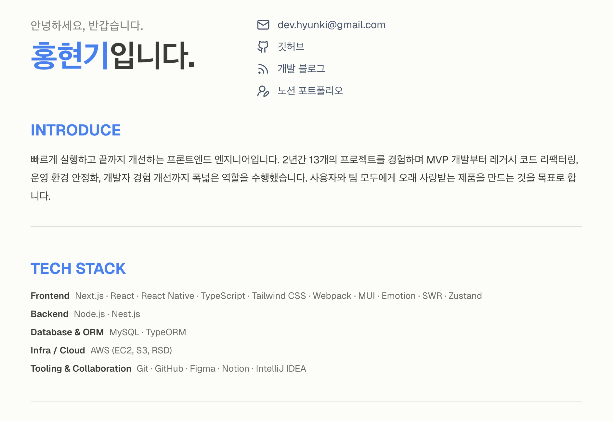

# ✨🧾 nextjs-resume 🧾✨



## Introduction

`lib/resume-data.ts` 파일만 수정하면 바로 사용할 수 있는 개발자 이력서 템플릿입니다.

이 파일에 이력서에 필요한 데이터와 SEO 메타데이터가 정리되어 있어,
내용을 수정하면 화면과 SEO 설정이 함께 반영됩니다.

데이터 수정 시에는 page.tsx의 수정도 필요합니다 !

## Stack

- Next.js 16
- TypeScript
- Tailwind CSS v4

## Development

```bash
pnpm install
pnpm dev
```

## Reference

- [요우](https://resume.yowu.dev/)님의 이력서를 많이 참고했습니다. 감사합니다 ! 🙇🏻‍♂️
